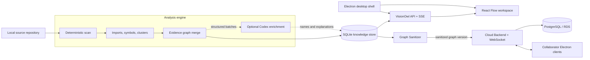

# VisionOwl

**An AI-assisted, local-first workspace for understanding complex codebases through evidence-backed architecture graphs.**

VisionOwl turns a source repository into an interactive knowledge map. It combines deterministic code analysis, optional Codex-powered semantic enrichment, module-level documentation, annotations, execution-path simulation, and contextual AI chat in one desktop experience.

Unlike architecture diagrams that quickly drift away from the code, VisionOwl keeps every generated relationship tied to source evidence such as files, symbols, and line numbers.

> VisionOwl now combines a local-first Electron analyzer with a separate Cloud Backend for shared Projects. Source code stays inside the authorized local analyzer; collaborators receive a sanitized, versioned graph plus shared documents and annotations.

## Why VisionOwl?

Large repositories are difficult to understand because architecture, code, documentation, and team knowledge usually live in different places:

- New contributors cannot quickly identify module boundaries or critical workflows.
- Hand-maintained architecture diagrams become outdated as the repository changes.
- AI-generated explanations are difficult to trust when they do not cite source evidence.
- Documentation and annotations are disconnected from the modules they describe.
- Static dependency graphs show structure, but rarely explain how a workflow may travel through the system.

VisionOwl treats source-derived facts as the foundation. AI can name, summarize, and explain those facts, but it does not invent unsupported modules or relationships.

## Features

### Evidence-backed architecture graph

- Accepts any local Git repository explicitly selected by the user in the desktop application.
- Uses the deterministic stages from [Understand Anything](https://github.com/Egonex-AI/Understand-Anything) to scan files, build import maps, detect symbols, cluster code, and merge a knowledge graph.
- Detects repository-level domains, internal modules, infrastructure dependencies, and evidence-backed cross-module flows.
- Preserves source citations on graph entities and relationships.
- Separates code domains from external resources such as Redis, MySQL, SLS, and remote services.

### Progressive analysis

- Publishes a factual base graph before semantic enrichment is complete.
- Streams analysis phases and progress to the UI with Server-Sent Events.
- Uses Codex concurrently to improve module names, responsibilities, architectural summaries, and guided flows.
- Falls back to deterministic analysis when Codex is disabled or unavailable.

### Interactive exploration

- Provides architecture overview, module focus, and path simulation views over the same graph.
- Supports domain-level and module-level selection.
- Highlights incoming, outgoing, and internal relationships without hiding relevant context.
- Uses an ELK-based layered layout to reduce crossings and keep directed flows readable.
- Shows relationship labels and evidence without requiring a node to be opened first.

### Module knowledge

- Attaches documents and annotations to individual modules or entire code domains.
- Supports project-wide documents that are not bound to a specific module.
- Displays related knowledge next to the selected graph node.
- Stores projects, graph versions, analysis jobs, documents, annotations, and chat sessions in SQLite.
- Generates a source-backed DingTalk document from the selected module and mounts it back onto that module.
- Offers a project-level Debug mode that watches new local commits and updates affected DingTalk documents.

### Contextual Codex chat

- Sends the selected module, neighboring relationships, source evidence, documents, and annotations as structured context.
- Streams intermediate analysis progress instead of leaving the user at a silent loading state.
- Returns facts, inferences, notes, call-chain summaries, and source citations separately.
- Reuses a conversation for follow-up questions about the same module.

### Desktop-first experience

- Runs as a browser application during development.
- Includes an Electron shell with a native repository picker.
- Keeps filesystem access in the Electron main process and exposes only a restricted preload API.

### Team cloud workspace

- Creates shared Projects with Owner, Editor, and Viewer roles.
- Uses revocable invitation tokens only for joining; normal access uses per-user sessions.
- Publishes graph versions after local and server-side sanitization.
- Synchronizes graphs, documents, annotations, membership, and version changes through WebSocket events.
- Encrypts the Electron cloud session with the operating system credential store.
- Runs as an isolated PostgreSQL-backed service with no filesystem or Shell endpoint.

## How It Works



The default **Direct Understand Engine** executes deterministic Understand Anything scripts directly, then asks Codex only for bounded semantic work. This is faster and easier to observe than asking one outer agent to orchestrate the entire analysis.

## Requirements

- macOS or Linux
- Node.js `22.5` or newer
- npm
- Python `3.10` or newer
- Git, for commit-aware graph freshness checks
- The Understand Anything `understand` skill
- Codex CLI or the Codex binary bundled with the ChatGPT desktop app, if AI enrichment and chat are enabled
- An authenticated DWS CLI, if DingTalk document creation or synchronization is enabled

VisionOwl looks for the Understand Anything skill in these locations:

1. `VISIONOWL_UNDERSTAND_SKILL_PATH`
2. The adjacent `Understand-Anything` repository used by this workspace
3. `~/.agents/skills/understand/SKILL.md`
4. `~/.codex/skills/understand/SKILL.md`

## Quick Start

### 1. Install dependencies

```bash
npm install
python3.12 -m venv .venv
.venv/bin/python -m pip install -r requirements.txt
```

### 2. Start the development environment

```bash
npm run dev
```

Open [http://127.0.0.1:4173](http://127.0.0.1:4173). The API runs on `http://127.0.0.1:17300`.

### 3. Analyze a repository

1. Select **Import Repository**.
2. Enter a project name and choose a local Git repository.
3. Start the analysis.
4. Follow the visible analysis phases while the factual graph is built and enriched.
5. Explore the architecture, select a module, inspect its evidence, attach knowledge, or ask Codex a question.

### 4. Generate and maintain module documents

1. Select a code module or code domain in the graph.
2. Choose **Generate Code Document** in the Agent panel.
3. VisionOwl runs the module-documentation Skill, creates a DingTalk document through DWS, and mounts the returned link on the selected module.
4. Enable **DEBUG** to use the current local commit as a baseline. Each later local commit is diffed against the last processed commit and updates documents bound to affected modules.

Debug mode reacts to commits, including commits that have not been pushed. Uncommitted working-tree changes do not trigger document updates.

## Desktop Mode

```bash
npm run desktop
```

This command builds the web application, starts the local API, and opens VisionOwl in Electron. The desktop database is stored in the application user-data directory.

VisionOwl now opens directly into the team workspace. An Owner creates a Project and selects an authorized local repository in one flow; the hidden Local Agent analyzes it, removes source excerpts and host paths, uploads a versioned graph, and activates it for the team. Owners can reanalyze and sync, create invitations, and manage members. Editors maintain documents and annotations, while Viewers remain read-only. Collaborators never need access to the Owner's local repository.

## Cloud Backend

For a memory-backed development server, run `npm run dev:cloud`. For PostgreSQL, set `DATABASE_URL`, run `npm run migrate:cloud`, then run `npm run start:cloud`.

Container definitions are in `infra/`. The demonstration stack includes PostgreSQL, the Cloud Backend, and an Nginx gateway. The production definition expects an RDS PostgreSQL private endpoint. See [VisionOwl云端部署手册.md](VisionOwl云端部署手册.md) for the ECS and RDS procedure.

## Production-style Local Run

```bash
npm run build
npm run start
```

Open the tokenized local URL printed by the server. In this mode, the API serves the production frontend build and generates a new Local Token for that process.

## Useful Commands

| Command | Purpose |
|---|---|
| `npm run dev` | Start the API and Vite development server |
| `npm run dev:web` | Start only the frontend; set the same `VITE_VISIONOWL_LOCAL_TOKEN` used by the API |
| `npm run dev:api` | Start only the backend with file watching; set `VISIONOWL_LOCAL_TOKEN` when pairing it with Vite |
| `npm run build` | Type-check and build the frontend |
| `npm test` | Run backend tests and the frontend production build |
| `npm run start` | Run the API and serve the built frontend |
| `npm run desktop` | Build and launch the Electron application |
| `npm run dev:cloud` | Run the Cloud Backend with an in-memory store |
| `npm run migrate:cloud` | Apply pending PostgreSQL migrations |
| `npm run start:cloud` | Run the PostgreSQL-backed Cloud Backend |

## Configuration

| Variable | Default | Description |
|---|---|---|
| `HOST` | `127.0.0.1` | API bind address |
| `PORT` | `17300` | API port |
| `PUBLIC_ROOT` | `frontend/dist` | Static frontend directory |
| `VISIONOWL_DB` | `data/visionowl.db` | SQLite database path |
| `VISIONOWL_LOCAL_TOKEN` | Random per launch | Local API session token; Electron and `npm run dev` create and pass it automatically |
| `VISIONOWL_CODEX_ENABLED` | `true` | Set to `false` for deterministic analysis only |
| `CODEX_BIN` | Auto-detected | Explicit Codex executable path |
| `PYTHON_BIN` | Auto-detected | Python 3.10+ executable used for graph merging |
| `VISIONOWL_UNDERSTAND_SKILL_PATH` | Auto-detected | Absolute path to Understand Anything's `SKILL.md` |
| `VISIONOWL_ANALYSIS_ENGINE` | `direct` | Use `direct` or the compatibility `legacy` engine |
| `VISIONOWL_SEMANTIC_CONCURRENCY` | `4` | Maximum concurrent semantic batches |
| `VISIONOWL_ENABLE_RUNTIME_PLUGINS` | `false` | Enables optional legacy runtime plugins |
| `VISIONOWL_ENABLE_REPO_WATCHER` | `true` | Enables the local commit watcher |
| `VISIONOWL_REPO_WATCH_INTERVAL_MS` | `10000` | Local commit polling interval in milliseconds |
| `DWS_BIN` | Auto-detected | Explicit DWS CLI executable path |
| `VISIONOWL_DINGTALK_FOLDER` | DWS default | Folder ID used when creating DingTalk documents |
| `VISIONOWL_DINGTALK_WORKSPACE` | DWS default | Workspace ID used when no folder is configured |
| `VISIONOWL_CLOUD_API_URL` | `http://127.0.0.1:17800` | Initial Cloud API address; users can change it on the Electron login screen |
| `DATABASE_URL` | None | PostgreSQL connection URL used only by the Cloud Backend |
| `PGSSL` | `false` | Enable strict TLS verification for PostgreSQL and migrations; production RDS Compose defaults it to `true` |
| `PGSSL_CA_FILE` | None | Optional CA bundle path inside the Cloud container |
| `VISIONOWL_ALLOWED_ORIGINS` | Local Electron/Vite origins | Explicit renderer origins accepted by the Cloud Backend |
| `VISIONOWL_ACCESS_TOKEN_TTL_SECONDS` | `3600` | Cloud access-token lifetime |
| `VISIONOWL_REFRESH_TOKEN_TTL_SECONDS` | `2592000` | Cloud refresh-token lifetime |
| `VISIONOWL_GRAPH_MAX_BYTES` | `5000000` | Maximum sanitized graph upload size |

Example deterministic-only run:

```bash
VISIONOWL_CODEX_ENABLED=false npm run dev
```

## Project Structure

```text
visionowl/
├── backend/                  HTTP API, analysis engine, SQLite, Codex adapter
├── cloud-backend/            Users, Projects, RBAC, graph versions, WebSocket, PostgreSQL
├── desktop/                  Electron main process and restricted preload
├── frontend/                 React, Vite, React Flow, and ELK graph UI
├── infra/                    Docker Compose, Nginx gateway, deployment templates
├── packages/contracts/       Shared TypeScript contracts
├── packages/graph-sanitizer/ Upload-safe graph conversion and validation
├── scripts/                  Development process orchestration
├── skills/
│   ├── graph-layout/         Reusable evidence-graph layout guidance
│   ├── module-documentation/ Source-backed module document generation rules
│   └── repository-understanding/
│                              VisionOwl repository-analysis rules
└── dark-glass-graph-ui/      Reusable dark glass graph UI skill
```

## Analysis Guarantees

VisionOwl follows several constraints to keep the graph useful and auditable:

1. Static relationships require source evidence.
2. AI enrichment may rename or explain facts, but may not fabricate dependencies.
3. Path simulation represents a source-supported possible interaction, not a production trace.
4. No synthetic latency, QPS, error rate, or health status is presented as observed data.
5. Analysis artifacts are versioned so a project can retain its last valid graph while a new scan is running.

## Local Security Boundary

VisionOwl's source-reading backend is a Local Agent, not a public web service. It binds only to a loopback host, requires a high-entropy session token, and validates Host and Origin. Users select local Git repositories at runtime; VisionOwl rejects filesystem roots and the user home directory, verifies the repository with Git, and pins each Project to the branch selected at creation. Analysis subprocesses inherit a reduced environment instead of all host credentials.

The endpoint `/api/projects/:projectId/graph/sanitized` produces the future cloud-upload artifact. It removes source excerpts and host paths, converts source locations to repository-relative paths, drops sensitive metadata keys, checks relation integrity, and rejects credential-shaped content.

## Current Limitations

- The first cloud release stores graph JSON in PostgreSQL. Moving large artifacts to OSS is an optional scale step and is not required for the current 5 MB limit.
- DingTalk creation and updates currently depend on a locally installed and authenticated DWS CLI.
- Debug synchronization watches local commits only while the VisionOwl backend is running; remote push webhooks are not implemented.
- Aone and GitLab repository connectors are not implemented.
- Function-level call analysis is incomplete for some languages and framework-generated behavior.
- The Electron package is intended for development and has not yet been signed or distributed as an installer.
- The optional historical M5 runtime adapter is disabled by default and is not part of the primary product flow.

Do not expose the Local Agent directly to a network. Multi-user access must use the separate Cloud Backend; only the sanitized graph endpoint bridges the two trust zones.

## Roadmap

- Shared online projects with invite-based access and real-time collaboration
- Aone and private GitLab repository synchronization
- Remote-branch webhooks and reviewable document-update jobs
- Stable module identity and graph diffs across commits
- Human review and correction of AI-generated semantic metadata
- Richer HTTP, RPC, message-queue, database, and function-call extraction
- Packaged and signed desktop releases

## Acknowledgements

VisionOwl builds on:

- [Understand Anything](https://github.com/Egonex-AI/Understand-Anything) for deterministic repository analysis and knowledge-graph generation
- [React Flow](https://reactflow.dev/) for interactive graph rendering
- [ELK](https://www.eclipse.org/elk/) for layered graph layout
- [Electron](https://www.electronjs.org/) for the desktop shell
