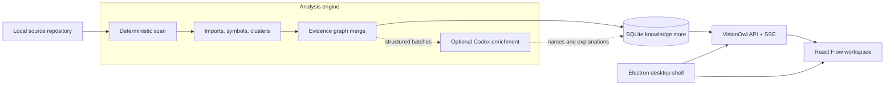

# VisionOwl

**An AI-assisted, local-first workspace for understanding complex codebases through evidence-backed architecture graphs.**

VisionOwl turns a source repository into an interactive knowledge map. It combines deterministic code analysis, optional Codex-powered semantic enrichment, module-level documentation, annotations, execution-path simulation, and contextual AI chat in one desktop experience.

Unlike architecture diagrams that quickly drift away from the code, VisionOwl keeps every generated relationship tied to source evidence such as files, symbols, and line numbers.

> VisionOwl is currently an early-stage local application. Multi-user collaboration, remote repository connectors, and automatic DingTalk document synchronization are planned but are not implemented yet.

## Why VisionOwl?

Large repositories are difficult to understand because architecture, code, documentation, and team knowledge usually live in different places:

- New contributors cannot quickly identify module boundaries or critical workflows.
- Hand-maintained architecture diagrams become outdated as the repository changes.
- AI-generated explanations are difficult to trust when they do not cite source evidence.
- Documentation and annotations are disconnected from the modules they describe.
- Static dependency graphs show structure, but rarely explain how a workflow may travel through the system.

VisionOwl treats source-derived facts as the foundation. AI can name, summarize, and explain those facts, but it does not invent unsupported modules or relationships.

## Features

### Evidence-backed architecture graph

- Imports any readable local repository.
- Uses the deterministic stages from [Understand Anything](https://github.com/Egonex-AI/Understand-Anything) to scan files, build import maps, detect symbols, cluster code, and merge a knowledge graph.
- Detects repository-level domains, internal modules, infrastructure dependencies, and evidence-backed cross-module flows.
- Preserves source citations on graph entities and relationships.
- Separates code domains from external resources such as Redis, MySQL, SLS, and remote services.

### Progressive analysis

- Publishes a factual base graph before semantic enrichment is complete.
- Streams analysis phases and progress to the UI with Server-Sent Events.
- Uses Codex concurrently to improve module names, responsibilities, architectural summaries, and guided flows.
- Falls back to deterministic analysis when Codex is disabled or unavailable.

### Interactive exploration

- Provides architecture overview, module focus, and path simulation views over the same graph.
- Supports domain-level and module-level selection.
- Highlights incoming, outgoing, and internal relationships without hiding relevant context.
- Uses an ELK-based layered layout to reduce crossings and keep directed flows readable.
- Shows relationship labels and evidence without requiring a node to be opened first.

### Module knowledge

- Attaches documents and annotations to individual modules or entire code domains.
- Supports project-wide documents that are not bound to a specific module.
- Displays related knowledge next to the selected graph node.
- Stores projects, graph versions, analysis jobs, documents, annotations, and chat sessions in SQLite.

### Contextual Codex chat

- Sends the selected module, neighboring relationships, source evidence, documents, and annotations as structured context.
- Streams intermediate analysis progress instead of leaving the user at a silent loading state.
- Returns facts, inferences, notes, call-chain summaries, and source citations separately.
- Reuses a conversation for follow-up questions about the same module.

### Desktop-first experience

- Runs as a browser application during development.
- Includes an Electron shell with a native repository picker.
- Keeps filesystem access in the Electron main process and exposes only a restricted preload API.

## How It Works



The default **Direct Understand Engine** executes deterministic Understand Anything scripts directly, then asks Codex only for bounded semantic work. This is faster and easier to observe than asking one outer agent to orchestrate the entire analysis.

## Requirements

- macOS or Linux
- Node.js `22.5` or newer
- npm
- Python `3.10` or newer
- Git, for commit-aware graph freshness checks
- The Understand Anything `understand` skill
- Codex CLI or the Codex binary bundled with the ChatGPT desktop app, if AI enrichment and chat are enabled

VisionOwl looks for the Understand Anything skill in these locations:

1. `VISIONOWL_UNDERSTAND_SKILL_PATH`
2. The adjacent `Understand-Anything` repository used by this workspace
3. `~/.agents/skills/understand/SKILL.md`
4. `~/.codex/skills/understand/SKILL.md`

## Quick Start

### 1. Install dependencies

```bash
npm install
```

### 2. Start the development environment

```bash
npm run dev
```

Open [http://127.0.0.1:4173](http://127.0.0.1:4173). The API runs on `http://127.0.0.1:17300`.

### 3. Analyze a repository

1. Select **Import Repository**.
2. Enter a project name and choose or type an absolute repository path.
3. Start the analysis.
4. Follow the visible analysis phases while the factual graph is built and enriched.
5. Explore the architecture, select a module, inspect its evidence, attach knowledge, or ask Codex a question.

## Desktop Mode

```bash
npm run desktop
```

This command builds the web application, starts the local API, and opens VisionOwl in Electron. The desktop database is stored in the application user-data directory.

## Production-style Local Run

```bash
npm run build
npm run start
```

Open [http://127.0.0.1:17300](http://127.0.0.1:17300). In this mode, the API serves the production frontend build.

## Useful Commands

| Command | Purpose |
|---|---|
| `npm run dev` | Start the API and Vite development server |
| `npm run dev:web` | Start only the frontend |
| `npm run dev:api` | Start only the backend with file watching |
| `npm run build` | Type-check and build the frontend |
| `npm test` | Run backend tests and the frontend production build |
| `npm run start` | Run the API and serve the built frontend |
| `npm run desktop` | Build and launch the Electron application |

## Configuration

| Variable | Default | Description |
|---|---|---|
| `HOST` | `127.0.0.1` | API bind address |
| `PORT` | `17300` | API port |
| `PUBLIC_ROOT` | `frontend/dist` | Static frontend directory |
| `VISIONOWL_DB` | `data/visionowl.db` | SQLite database path |
| `VISIONOWL_CODEX_ENABLED` | `true` | Set to `false` for deterministic analysis only |
| `CODEX_BIN` | Auto-detected | Explicit Codex executable path |
| `PYTHON_BIN` | Auto-detected | Python 3.10+ executable used for graph merging |
| `VISIONOWL_UNDERSTAND_SKILL_PATH` | Auto-detected | Absolute path to Understand Anything's `SKILL.md` |
| `VISIONOWL_ANALYSIS_ENGINE` | `direct` | Use `direct` or the compatibility `legacy` engine |
| `VISIONOWL_SEMANTIC_CONCURRENCY` | `4` | Maximum concurrent semantic batches |
| `VISIONOWL_ENABLE_RUNTIME_PLUGINS` | `false` | Enables optional legacy runtime plugins |

Example deterministic-only run:

```bash
VISIONOWL_CODEX_ENABLED=false npm run dev
```

## Project Structure

```text
visionowl/
├── backend/                  HTTP API, analysis engine, SQLite, Codex adapter
├── desktop/                  Electron main process and restricted preload
├── frontend/                 React, Vite, React Flow, and ELK graph UI
├── packages/contracts/       Shared TypeScript contracts
├── scripts/                  Development process orchestration
├── skills/
│   ├── graph-layout/         Reusable evidence-graph layout guidance
│   └── repository-understanding/
│                              VisionOwl repository-analysis rules
└── dark-glass-graph-ui/      Reusable dark glass graph UI skill
```

## Analysis Guarantees

VisionOwl follows several constraints to keep the graph useful and auditable:

1. Static relationships require source evidence.
2. AI enrichment may rename or explain facts, but may not fabricate dependencies.
3. Path simulation represents a source-supported possible interaction, not a production trace.
4. No synthetic latency, QPS, error rate, or health status is presented as observed data.
5. Analysis artifacts are versioned so a project can retain its last valid graph while a new scan is running.

## Current Limitations

- The application is local-first and has no user accounts or project authorization.
- DingTalk documents are currently attached as links; automatic API synchronization is not implemented.
- Aone and GitLab repository connectors are not implemented.
- Function-level call analysis is incomplete for some languages and framework-generated behavior.
- The Electron package is intended for development and has not yet been signed or distributed as an installer.
- The optional historical M5 runtime adapter is disabled by default and is not part of the primary product flow.

Do not expose the current API directly to an untrusted network. It accepts local repository paths and does not yet provide authentication or authorization.

## Roadmap

- Shared online projects with invite-based access and real-time collaboration
- Aone and private GitLab repository synchronization
- DingTalk document API synchronization and AI-assisted document updates
- Stable module identity and graph diffs across commits
- Human review and correction of AI-generated semantic metadata
- Richer HTTP, RPC, message-queue, database, and function-call extraction
- Packaged and signed desktop releases

## Acknowledgements

VisionOwl builds on:

- [Understand Anything](https://github.com/Egonex-AI/Understand-Anything) for deterministic repository analysis and knowledge-graph generation
- [React Flow](https://reactflow.dev/) for interactive graph rendering
- [ELK](https://www.eclipse.org/elk/) for layered graph layout
- [Electron](https://www.electronjs.org/) for the desktop shell
